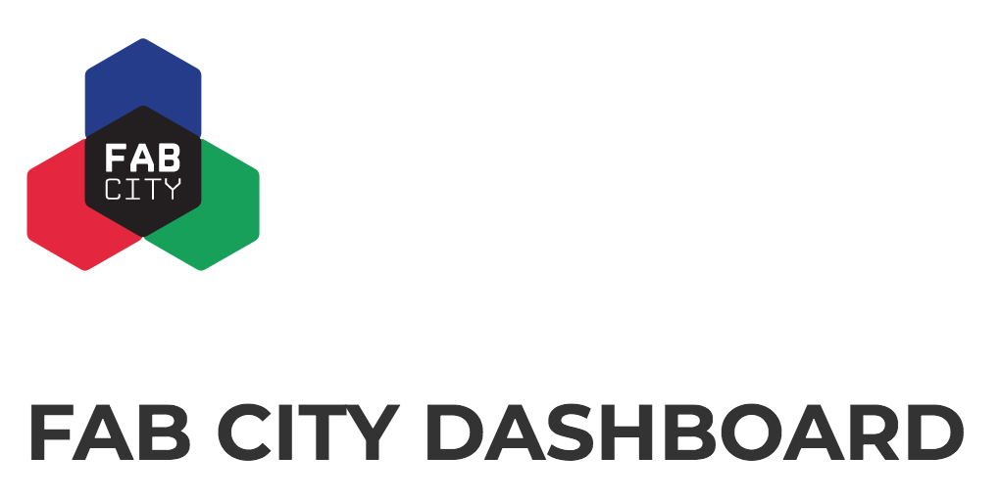
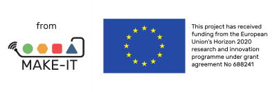

A dashboard for all the Fab Cities where citizens, civic leaders, digital fabrication laboratories and makers can understand the existing resilience of their cities and how they are having an impact on it.

A first prototype developed during [Visualizar'16](http://medialab-prado.es/article/agenda-visualizar16).

The proposal aims at developing a visualisation tool for Fab Cities that show the relationships between urban spaces and their networks of design, production and consumption by highlighting their supply chains, resilience and impact. Such a tool can help cities and citizens to understand how citizens design and produce in urban spaces within networks of suppliers, manufacturers, craftsmen, fab labs, makerspaces, hackerspaces. The project focuses on a dashboard for all the Fab Cities, where citizens can understand the existing resilience of cities regarding manufacturing, and how the Maker movement is having an impact on this. Citizens will be able to document and discuss their projects and their impact on the local systems and networks.

## Installation
`virtualenv env`

`source env/bin/activate`

`pip install -r requirements.txt`

`python run.py`

## License

[AGPL](https://www.gnu.org/licenses/agpl-3.0.en.html)
 
## Credits

